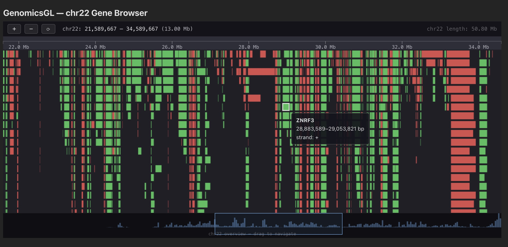

# GenomicsGL

A simplified genome browser using Rust, WebAssembly, WebGL, and React. It loads real genomic data, renders tracks at 60fps, and handles zooming and panning efficiently.



- **WebGL gene track** — thousands of chr22 annotations rendered as GPU quads via raw `web-sys`; green = `+` strand, red = `-` strand; features packed into rows by a greedy overlap algorithm on the CPU
- **Off-main-thread parsing** — BED file is parsed and range-queried inside a WebWorker using a Rust/Wasm data engine with a UCSC binning index; the main thread never blocks
- **Zoom & pan** — mouse wheel zooms centred on cursor; click-drag pans; viewport clamped from 500 bp to full chromosome length
- **Hover tooltip** — hit-tests rendered features in screen coordinates; shows gene name, bp coordinates, and strand; 2D canvas overlay draws a highlight rect around the hovered feature
- **D3 SVG axis** — smart tick density at any zoom level using D3 scale, rendered as an SVG overlay aligned to the WebGL canvas
- **Overview brush** — full chr22 density histogram rendered below the main track using D3; drag the brush to navigate; two-way synced with zoom/pan

---

## Prerequisites

- [Rust](https://rustup.rs/) + `wasm-pack` (`cargo install wasm-pack`)
- Node.js 18+

## Getting started

```bash
# Install JS dependencies
cd web && npm install

# Build the Wasm pkg (required once before first run, and after any Rust changes)
npm run build:wasm

# Start dev server
npm run dev
```

The dev server runs at `http://localhost:5173`.

To run the Rust unit tests independently:

```bash
cargo test -p genome-engine
```

---

## Project Documents

| Document | Description |
|---|---|
| [JD.md](JD.md) | The EMBL-EBI Rust Frontend Developer job description that inspired this project |
| [background.md](background.md) | Domain context: what EMBL-EBI and Ensembl are, why this stack, and what a genome browser actually does |
| [pre-prd.md](pre-prd.md) | Early project concept document — bridges the JD to a concrete build plan, covering rationale and approach before the formal spec was written |
| [PRD.md](PRD.md) | Full product requirements: architecture, MVP scope, rendering design, testing strategy, and definition of done |
| [spikes.md](spikes.md) | Three isolated proof-of-concept experiments (Wasm boundary, WebGL rectangle, Wasm-in-WebWorker) completed before the main build |
| [impl-1-data-engine.md](impl-1-data-engine.md) | Guided implementation notes for the Rust data engine (PRD MVP item 1) — BED parser, UCSC binning index, and wasm-bindgen exports |
| [impl-2-worker.md](impl-2-worker.md) | Guided implementation notes for the WebWorker integration (PRD MVP item 2) |
| [impl-3-WebGL.md](impl-3-WebGL.md) | Guided implementation notes for the WebGL renderer (PRD MVP item 3) |
| [scientist-ux.md](scientist-ux.md) | Scientist UX research — who uses genome browsers, what they expect, and the follow-on tasks derived from that analysis |
