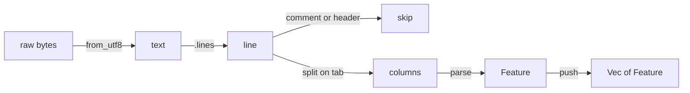

# Impl 1: Data Engine (Rust)

> PRD MVP item 1

---

## Overview

Implementing the Rust data engine — the core of the whole project. Three files to fill in, in this order:

### 1. `parser.rs` — BED Parser ✓

Turn raw bytes (`&[u8]`) into a `Vec<Feature>`. The BED format is tab-separated:

```
chr22   10000   10500   GENE1   0   +
chr22   20000   21000   GENE2   0   -
```

You need to: skip comment/header lines, split each line on `\t`, parse the columns, map the strand string to your `Strand` enum.

#### What is a BED parser?

BED (Browser Extensible Data) is a plain-text format used in genomics to describe regions on a chromosome — where a gene is, from which position to which position, on which strand.

A BED parser reads that text and turns it into structured data you can work with — in our case, a `Vec<Feature>`.

**Why `Feature`?** It's genomics vocabulary. A feature is any annotated region on a genome — a gene, an exon, a promoter. It's the standard term across all genomics file formats. Anyone from a bioinformatics background reads `Feature` and immediately knows what it means.

**What the parser does, step by step:**



Pure data transformation — no network, no web endpoint.

**Where does it run?**

Inside the WebWorker. The BED file is bundled as a static asset (`web/public/data/sample.bed`). The browser fetches it, passes the raw bytes to the worker via `postMessage`, and the Rust parser takes it from there:

```
fetch("sample.bed") → ArrayBuffer
    ↓  postMessage({ type: 'load', data: ArrayBuffer })
WebWorker → load_bed(data) → parse_bed(data) → build index
    ↓  postMessage({ type: 'ready' })
Main thread can now query
    ↓  postMessage({ type: 'query', start, end })
WebWorker → get_features_in_range(start, end)
    ↓  postMessage({ type: 'result', features })
Main thread renders
```

### 2. `index.rs` — UCSC Binning Index ✓

The `Vec<Feature>` from the parser is the input to the index.

The parser answers **"what features exist?"** — a flat list of everything in the file. The index answers **"what features are in this region right now?"** — it organises that list so range questions are efficient.

Without an index, every pan or zoom would scan the entire list. chr22 has ~14,000 gene annotations and the user queries dozens of times per second. The UCSC binning index pre-sorts features into buckets by location at build time, so at query time you only look in the buckets that could overlap the current range.

**Build time** (once, after `parse_bed`):
```
Vec<Feature>  →  GenomeIndex { bins: HashMap<u32, Vec<usize>> }
```

**Query time** (every pan/zoom):
```
query(start, end)  →  compute overlapping bins  →  Vec<&Feature>
```

**Full flow across both files:**
```
parse_bed(&[u8])
    → Vec<Feature>                   ← parser.rs output
        → GenomeIndex::build(vec)    ← index.rs consumes it
            → .query(start, end)     ← called on every viewport change
                → Vec<&Feature>      ← what the renderer receives
```

The parser runs once on load. The index is built once. The query runs continuously as the user interacts.

### 3. `lib.rs` — Wire it together + wasm-bindgen exports ✓

At this point you have:
- `parser.rs` — turns bytes into `Vec<Feature>`
- `index.rs` — turns `Vec<Feature>` into a queryable `GenomeIndex`

`lib.rs` does two things: **holds the index as global state** and **exposes three functions to JS** via `wasm-bindgen`.

#### The global state problem

Wasm has no concept of a persistent object between calls — each function call is stateless by default. But you need the index to survive between calls: `load_bed` builds it, then `get_features_in_range` queries it later.

The solution is `thread_local!` — Rust's idiomatic way to hold mutable state in single-threaded Wasm:

```rust
thread_local! {
    static INDEX: RefCell<Option<GenomeIndex>> = RefCell::new(None);
}
```

`Option<GenomeIndex>` — starts as `None`, becomes `Some` after `load_bed` is called.
`RefCell` — allows interior mutability (needed because `static` is otherwise immutable).

#### The three exported functions

**`load_bed`** — called once by the worker after receiving the ArrayBuffer:
```
bytes → parse_bed → GenomeIndex::build → store in INDEX
```

**`get_features_in_range`** — called on every viewport query:
```
borrow INDEX → .query(start, end) → serialize to JsValue → return to JS
```
Serialization uses `serde_wasm_bindgen::to_value` — converts `Vec<&Feature>` to a JS array.

**`chromosome_length`** — called once after load to set the initial viewport:
```
borrow INDEX → .chromosome_length() → return u32
```

#### Why `JsValue` as return type?

JS doesn't know what a Rust `Vec<Feature>` is. `JsValue` is wasm-bindgen's universal wrapper — it lets you pass arbitrary data across the Wasm boundary. `serde_wasm_bindgen` handles the serialization from Rust structs to JS objects.
